# Automatización de Pruebas - Examen Final - Isabella Parry

## Descripción

Proyecto desarrollado para aplicar control de versiones,
automatización de pruebas, integración continua y despliegue automatizado.

## Tecnologías

- Java 17
- Maven
- JUnit 5
- H2
- Git
- GitHub
- GitHub Actions
- Visual Studio Code

Se utilizó Trunk-Based simplificado.

La rama `main` mantiene el código estable y los cambios
se desarrollan mediante ramas de corta duración (ramas feature).

El pipeline ejecuta:

1. Build.
2. Unit Tests.
3. Integration Tests.

Para ejecutar todas las pruebas localmente:

```bash
mvn clean verify
```

---

# Evidencias del desarrollo

## Actividad 1

Primero creamos el proyecto Maven mediante comandos.

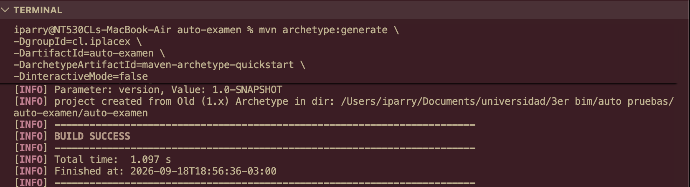

Después utilizamos `git init` para inicializar Git y configuramos `main` como rama principal.

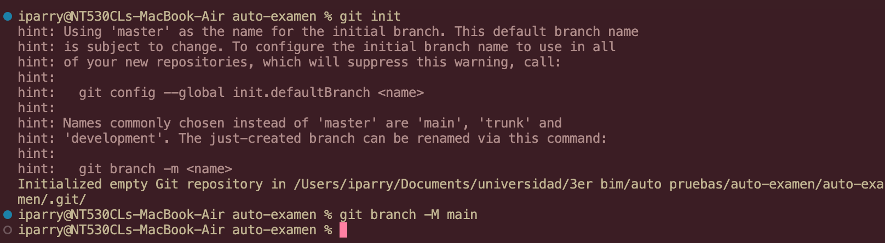

Creamos el archivo `.gitignore` para excluir archivos y directorios que no deben almacenarse en el repositorio.

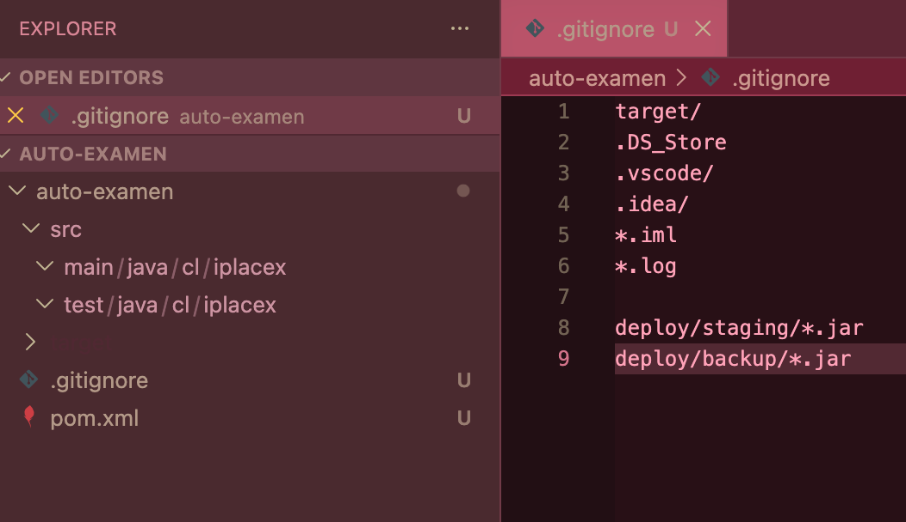

Luego modificamos el archivo `pom.xml`, agregando las dependencias necesarias para las pruebas automatizadas.

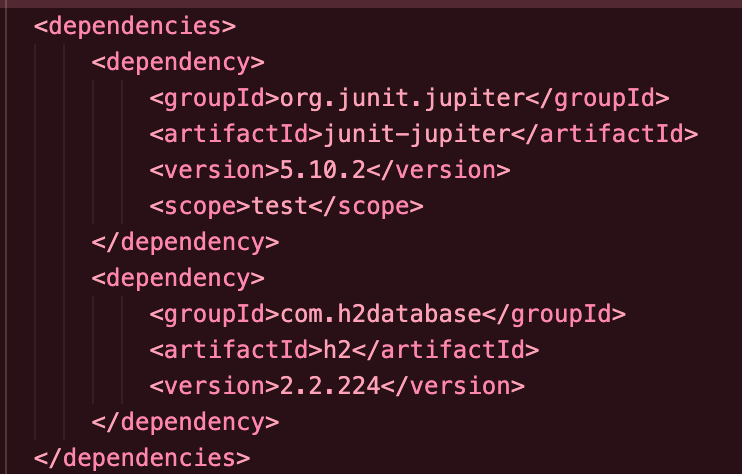

También configuramos los plugins necesarios para la ejecución de pruebas unitarias, pruebas de integración y la generación del archivo JAR ejecutable.

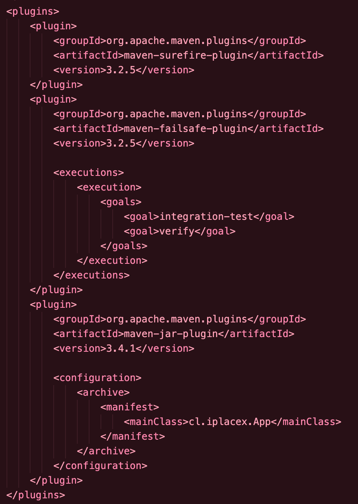

A continuación, creamos una nueva rama para demostrar un flujo **Trunk-Based simplificado**.

```bash
git checkout -b feature/pruebas
git branch
```

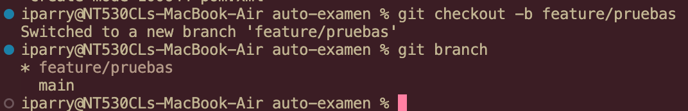

La rama `main` mantiene la versión estable del proyecto y las modificaciones se realizan en ramas de corta duración (`feature`), las cuales posteriormente se integran mediante Pull Request una vez que las pruebas han finalizado correctamente.

---

## Actividad 2

Para las pruebas unitarias creamos la clase `Calculadora` junto con su respectiva clase `CalculadoraTest`.

Estas pruebas permiten comprobar de manera aislada el correcto funcionamiento de las operaciones implementadas.

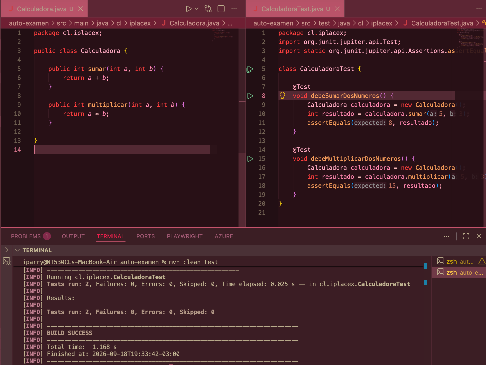

Para las pruebas de integración implementamos `LoginService`, `UsuarioRepository` y `LoginIntegrationIT`.

Estas pruebas permiten comprobar la interacción entre el servicio de autenticación y la base de datos utilizada durante las pruebas.

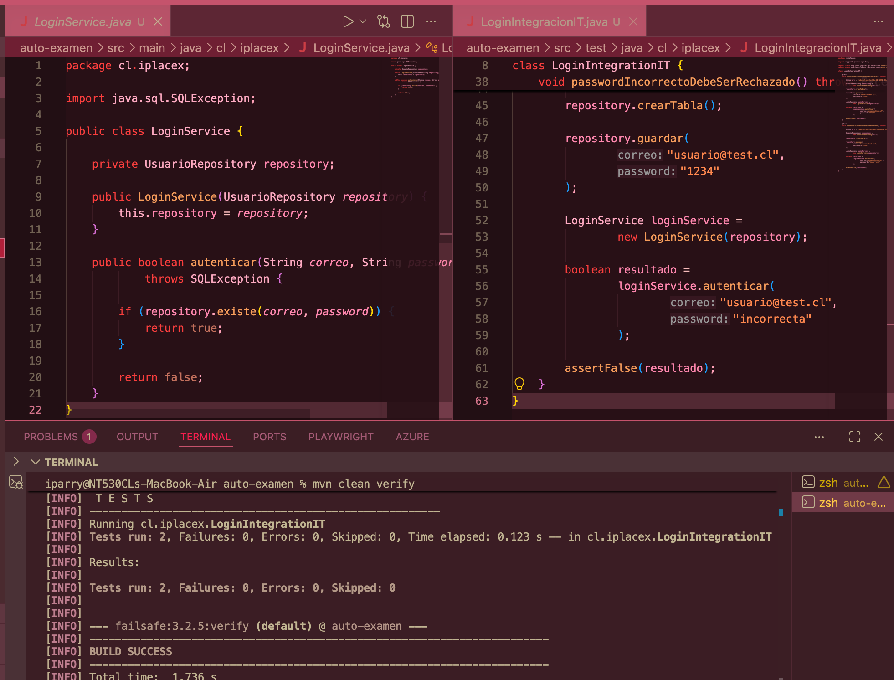

Para verificar las pruebas utilizamos:

```bash
mvn clean verify
```

Con este comando Maven ejecuta las pruebas configuradas y permite comprobar que el proyecto finaliza correctamente.

Luego de realizar el `push`, revisamos GitHub Actions. El pipeline de integración continua contiene los stages:

- **Build**
- **Unit Tests**
- **Integration Tests**

Todos los stages finalizaron correctamente.

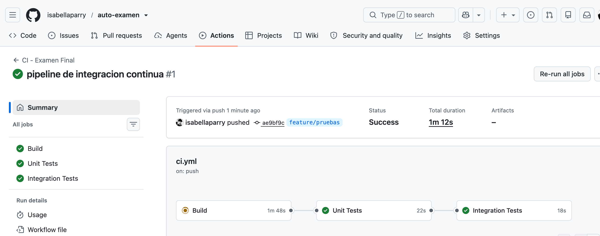

Una vez comprobado el correcto funcionamiento del pipeline, realizamos un Pull Request desde la rama `feature/pruebas` hacia `main`.

Las validaciones fueron ejecutadas correctamente antes de realizar el merge.

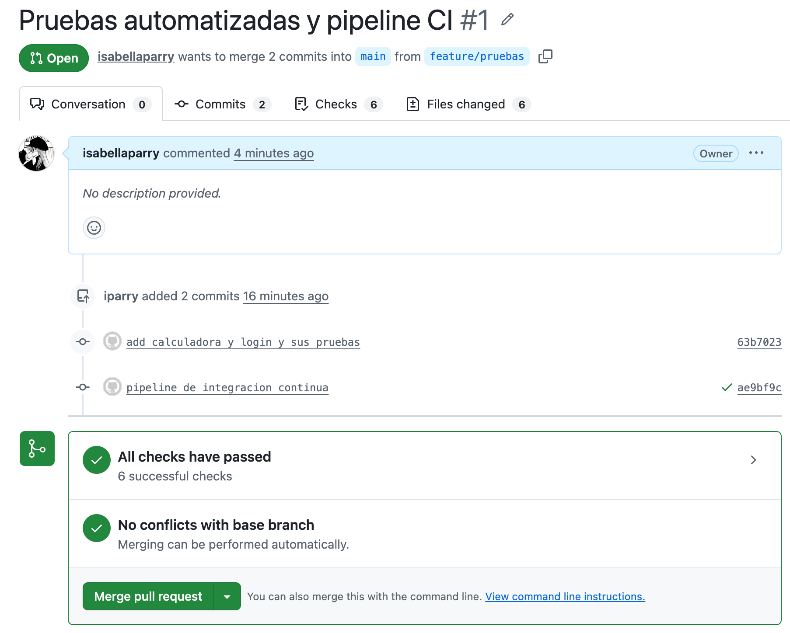

---

## Actividad 3

Para implementar el deployment pipeline con stages de **Acceptance Tests** y despliegue en un ambiente de pruebas, primero creamos una nueva rama:

```bash
git checkout -b feature/deployment
```

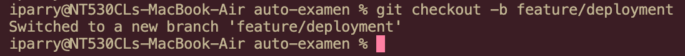

Luego creamos el archivo `App.java` para disponer de una aplicación ejecutable durante el despliegue.

Esta clase incorpora una validación básica de estado mediante el parámetro `health`, devolviendo `OK` cuando la aplicación se encuentra disponible.

Esta respuesta se utiliza posteriormente como prueba de aceptación y como **health check** durante el despliegue.

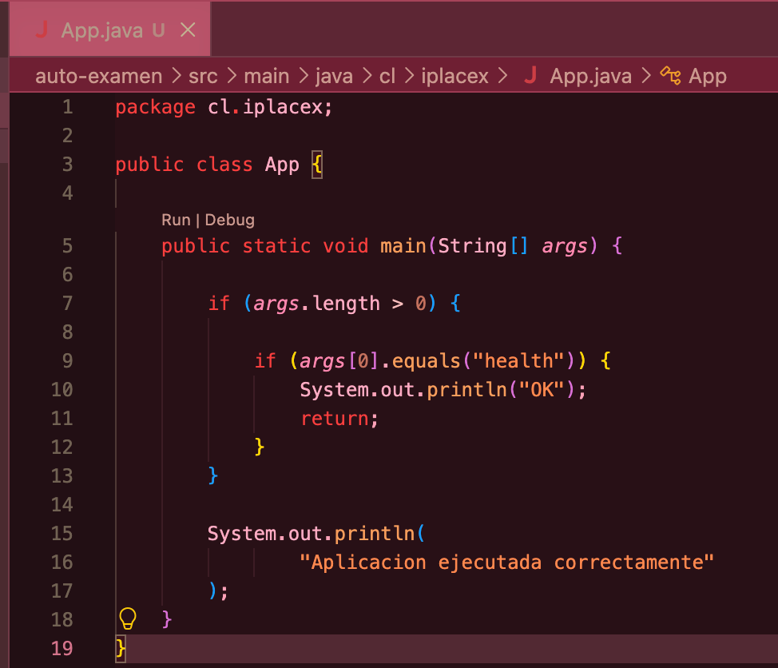

A continuación construimos el archivo `.jar` mediante:

```bash
mvn clean package
```

Después comprobamos manualmente que la aplicación puede ejecutarse:

```bash
java -jar target/automatizacion-examen-1.0-SNAPSHOT.jar
```

También verificamos el health check:

```bash
java -jar target/automatizacion-examen-1.0-SNAPSHOT.jar health
```

La respuesta esperada para esta última ejecución es:

```text
OK
```

De esta manera comprobamos previamente el comportamiento que posteriormente será validado de forma automática por el pipeline.

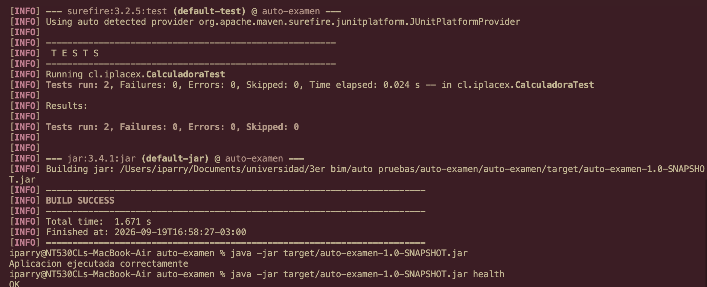

Posteriormente creamos los directorios `scripts` y `deploy`.

Dentro de `deploy` se utilizan los directorios:

```text
deploy/
├── backup/
└── staging/
```

Esto permite representar un flujo similar a un ambiente de pruebas o staging.

Dentro de `scripts` creamos el archivo `deploy.sh`, encargado de copiar la nueva versión de la aplicación al ambiente de staging.

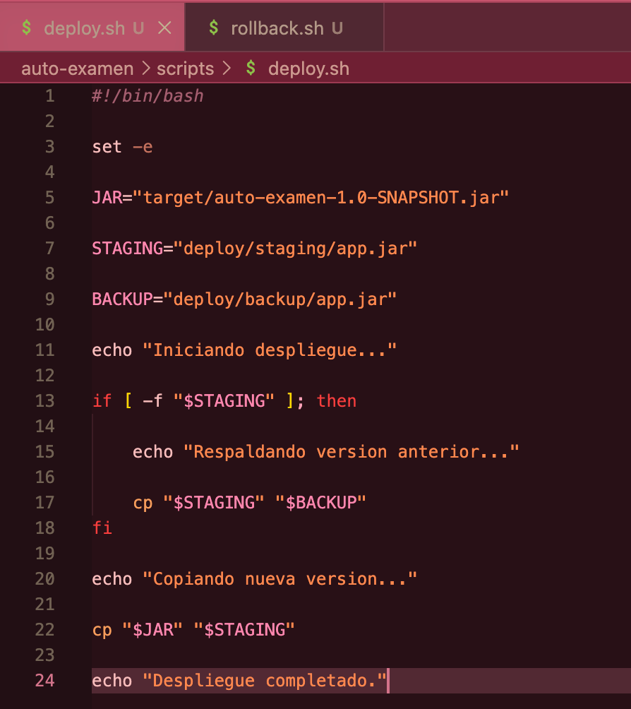

También creamos el archivo `rollback.sh`, encargado de restaurar una versión anterior cuando sea necesario.

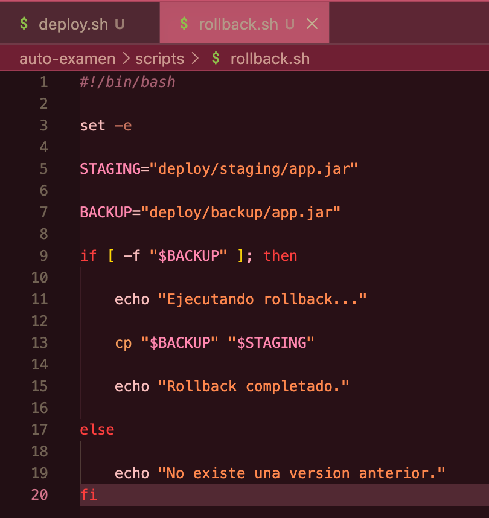

Después creamos el archivo:

```text
.github/workflows/deployment.yml
```

Este archivo contiene la configuración del pipeline de despliegue, incluyendo los stages de:

1. **Build**
2. **Acceptance Tests**
3. **Deploy Staging**

Luego subimos los cambios de la rama `feature/deployment` al repositorio.

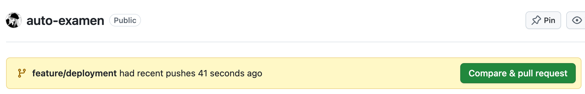

Posteriormente realizamos el Pull Request y merge correspondiente para que el workflow de deployment quedara disponible desde GitHub Actions.

Desde la sección **Actions** seleccionamos `Deployment Pipeline` y ejecutamos manualmente el workflow.

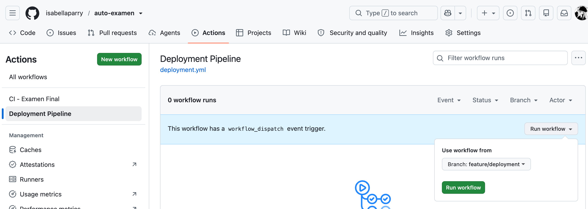

El pipeline de despliegue ejecutó correctamente los tres stages:

```text
Build
   ↓
Acceptance Tests
   ↓
Deploy Staging
```

Todos finalizaron exitosamente.

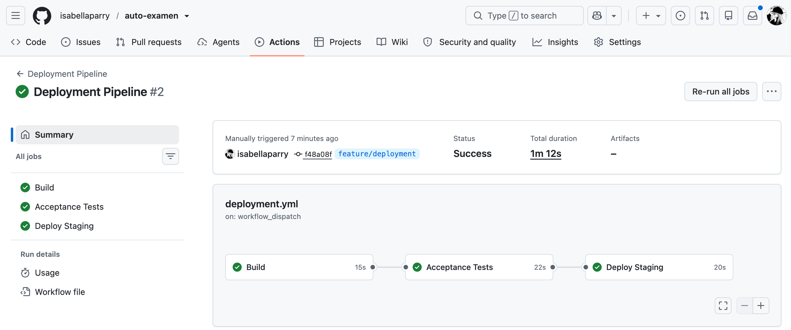

### Acceptance Tests

Al revisar el stage **Acceptance Tests**, se puede observar la ejecución del health check:

```bash
java -jar target/automatizacion-examen-1.0-SNAPSHOT.jar health
```

Si el resultado obtenido es `OK`, el pipeline continúa hacia el despliegue.

En la ejecución realizada se obtuvo:

```text
Acceptance Test exitoso
```

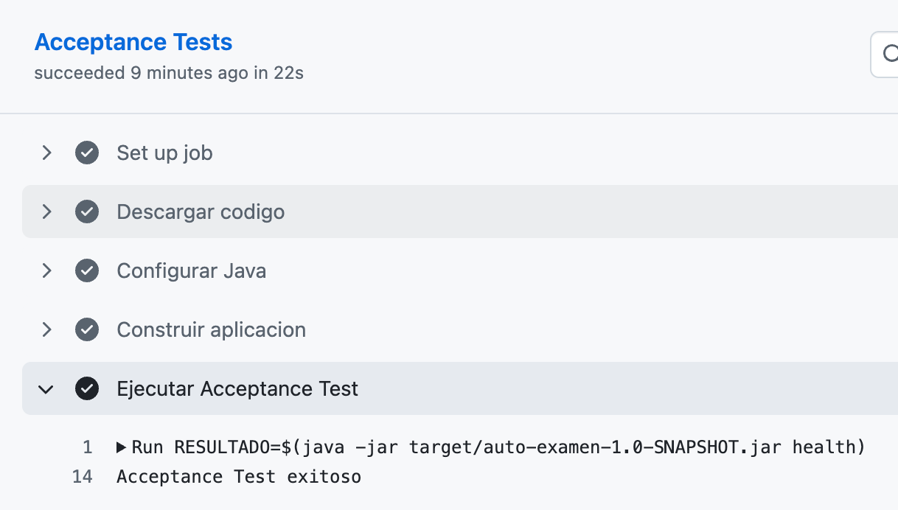

### Deploy Staging

Finalmente, el stage **Deploy Staging** ejecuta el script:

```bash
./scripts/deploy.sh
```

Este script copia la nueva versión de la aplicación al ambiente de staging.

Después se ejecuta nuevamente el health check sobre el artefacto desplegado:

```bash
java -jar deploy/staging/app.jar health
```

Al obtener la respuesta esperada, el pipeline informa:

```text
Deployment exitoso
```

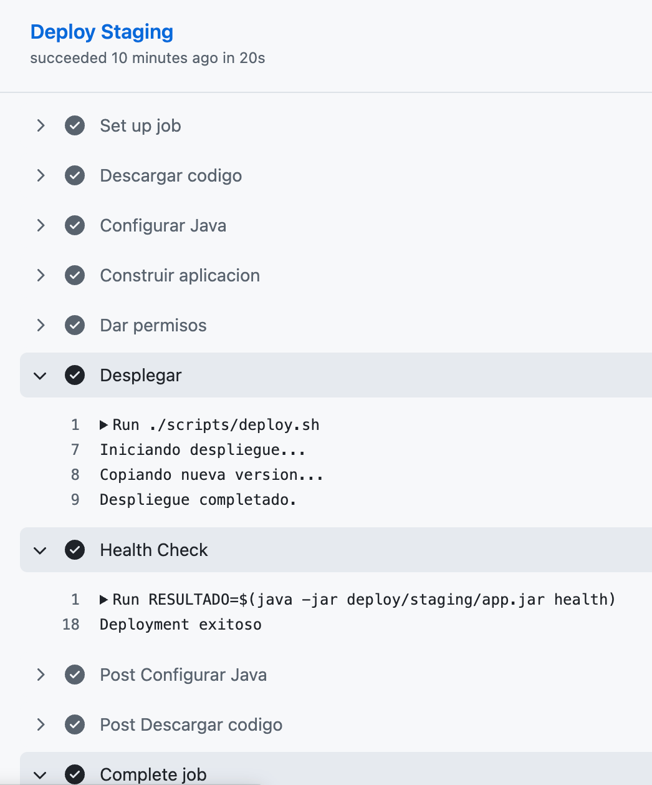

---

## Resultado final

Con el desarrollo de las tres actividades se implementó un flujo completo que considera:

- Control de versiones mediante Git y GitHub.
- Estrategia de ramas Trunk-Based simplificada.
- Gestión de dependencias y construcción mediante Maven.
- Pruebas unitarias con JUnit.
- Pruebas de integración.
- Pipeline de integración continua con GitHub Actions.
- Generación de un artefacto JAR ejecutable.
- Acceptance Tests.
- Despliegue en un ambiente de staging.
- Health check posterior al despliegue.
- Mecanismo de rollback mediante scripts.

De esta forma, el proyecto integra automatización de pruebas, integración continua y despliegue automatizado, manteniendo evidencia de cada etapa realizada.